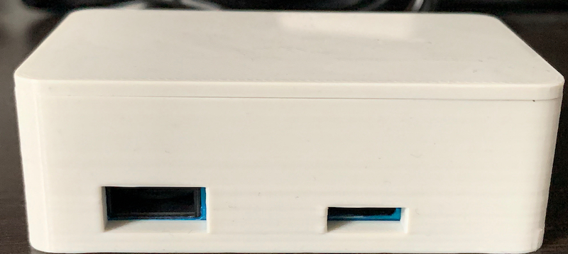

# Air Quality Monitoring Sensor for Home Assistant

Sensor is based on an ESP-M3 and Plantronix PMS7003, specialy created for [Home Assistant](https://www.home-assistant.io/), software is based on [Esphome](https://www.esphome.io/)

# Building sensor

Device is build based on custom desing PCB for small size, it only need wires to 5V and aditional LED (was added after designed PCB)

Components:

- ESP-M3
- Mini 360 buck converter
- PMS 7003 header (should by in box with sensor)
- optional temperature sensor BME 280 / BMP 280
- optional LED WS2812B mini pcb

Connecting is simple, just solder pms header, ESP-M3 and mini360 on PCB, connect optional BME 280 temperature sensor

Additional LED (WS2812B) can be connected by wires to pin GPIO2

# Cases

In Stl folder You can find cases for sensor with aditional BME280 temperature sensor and LED for status

Sample firmware is in YAML folder, just change SSID nad Password.
